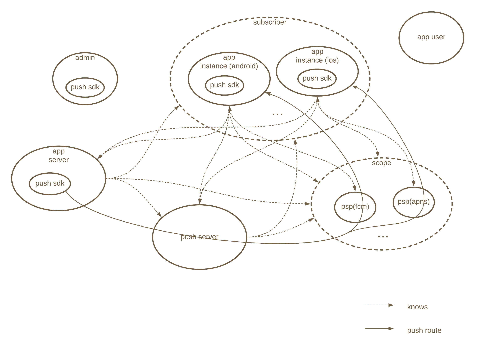
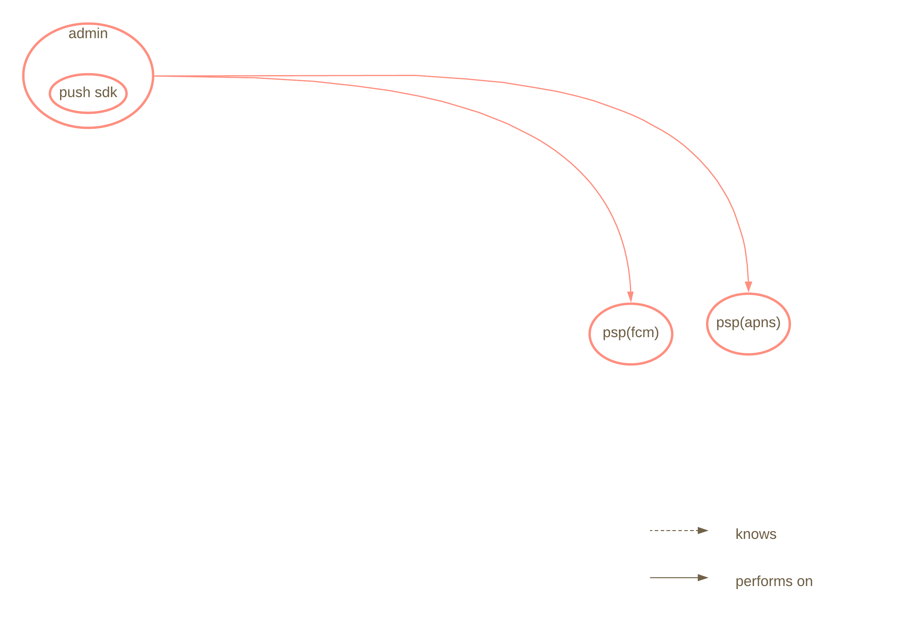
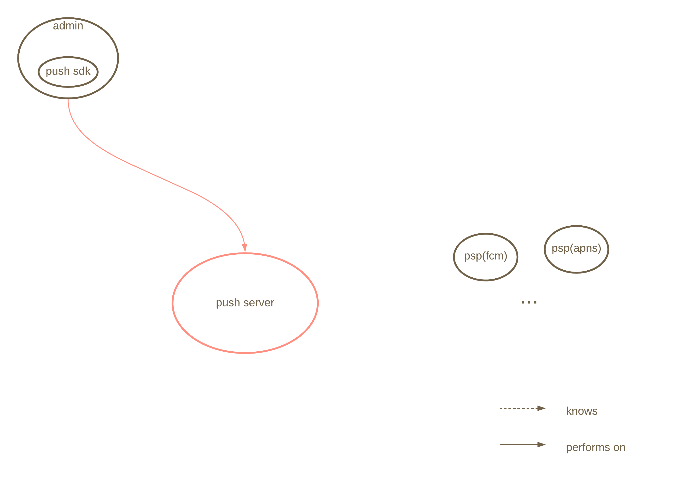
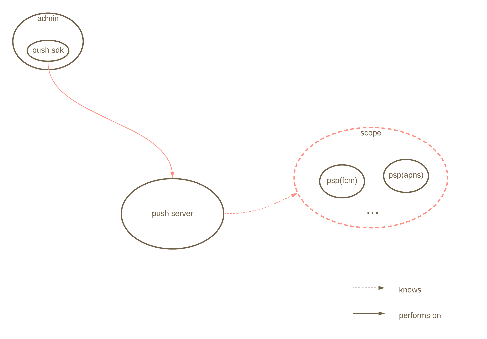
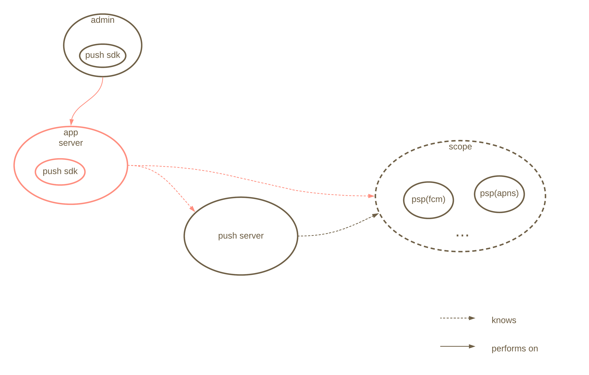
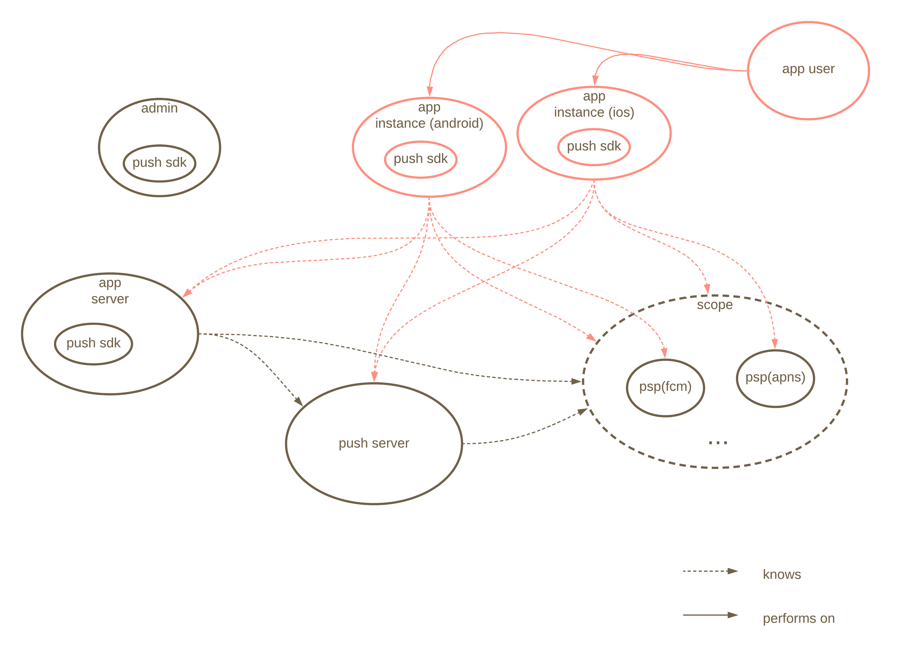
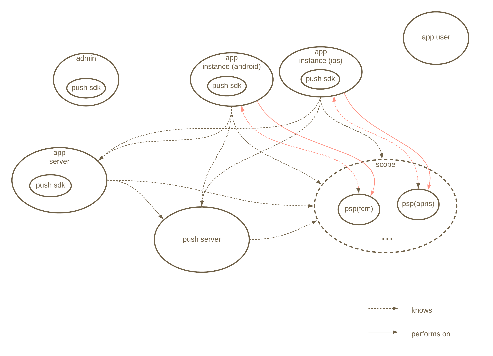
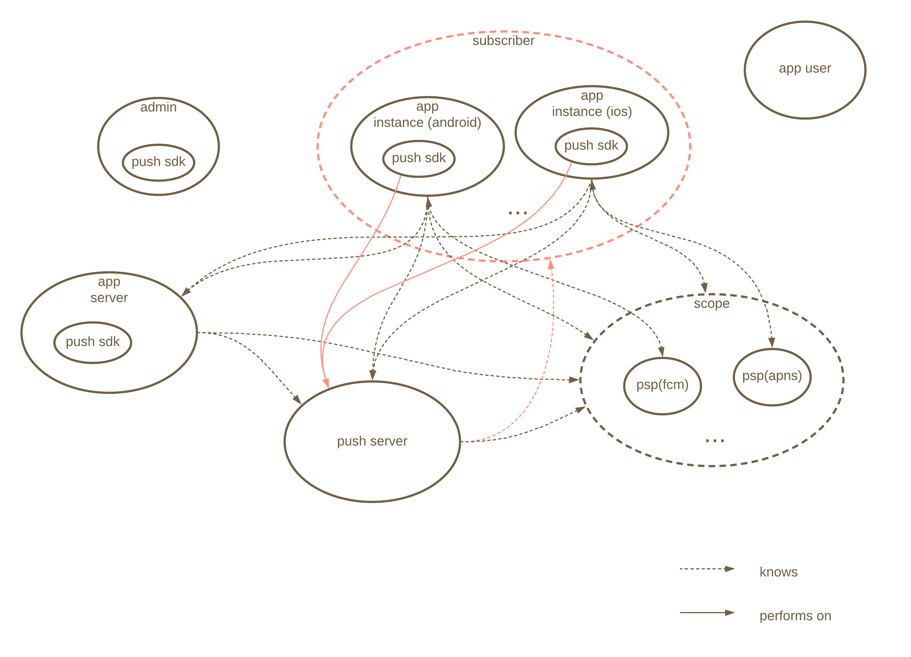
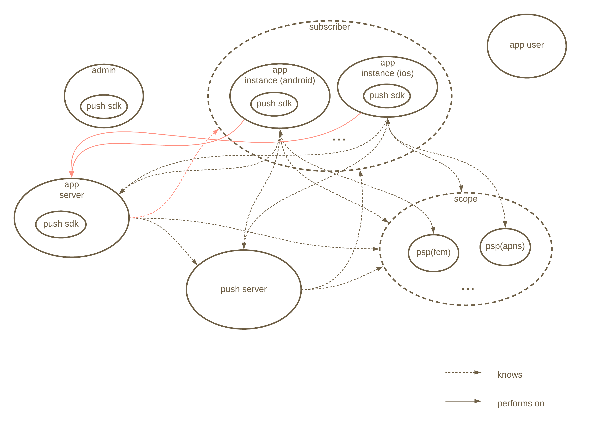
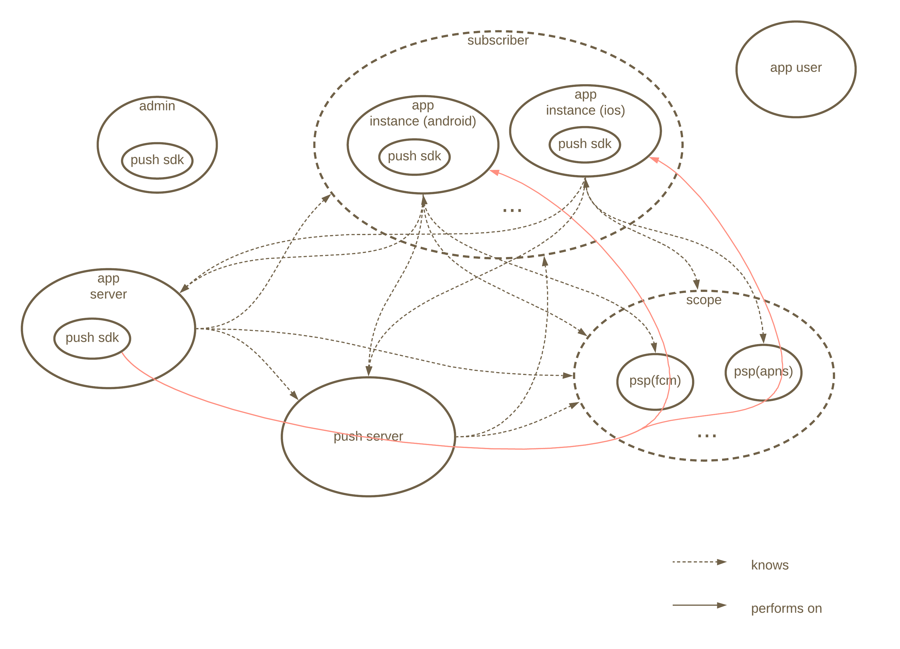

# Overview



# Definitions

- Push Service Provider(PSP)：A push service provider can push data to a device. Only FCM and APNs are supported at present. FCM and APNs projects are identified by project ID and certificate, respectively.
- Scope：A set of PSPs, identiified by scope name.
- App instance：Specific app instance runs on specific Android or IOS device. Android and IOS app instances are identified by reg ID and dev token, respectively.
- Subscriber：A set of app instances, identified by event ID.

# Example

- Admin deploying PSPs

  

  - For FCM

    Admin obtains project ID **"push example project id"** and server key **"push example server key"** from firebase console. 

  - For APNs

    Admin obtains p12 certificate **push_example_certificate.p12** from apple. 

- Admin deploying push server on **pushexample.com:9898**

  

  Admin converts  **push_example_certificate.p12** into two pem files **push_example_certificate.pem** and **push_example_private_key.pem** and put them on push server under **/etc/push**.

- Admin configuring scope **"push example scope"** on push server

  

  - For FCM

    ```c
    push_server_t push_server = {
        .host = "pushexample.com",
      	.port = "9898"
    };
    registered_project_key_t project_key = {
    		.service_type = "fcm",
      	.project_id   = "push example project id",
      	.api_key      = "push example server key"
    };
    
    register_push_service(&push_server, "push example scope", 
                          (const registered_data_t *)&project_key);
    ```

    

  - For APNs

    ```c
    push_server_t push_server = {
        .host = "pushexample.com",
      	.port = "9898"
    };
    registered_certificate_t certificate = {
    		.service_type 	  = "apns",
      	.certificate_path = "/etc/push/push_example_certificate.pem",
      	.private_key_path = "/etc/push/push_example_private_key.pem"
    };
    
    register_push_service(&push_server, "push example scope", 
                          (const registered_data_t *)&certificate);
    ```

- Admin deploying app server

  

- App user installing app instance

  

- App instance obtaining reg ID(for Andorid) **"push example reg id"** and dev token(for IOS) **"push example dev token"** from PSP

  

- App instance subscribing scope **"push example scope"** with event ID **"push example subscriber"** from push server

  

  - For Android

    ```c
    push_server_t push_server = {
        .host = "pushexample.com",
      	.port = "9898"
    };
    subscribed_project_id_t project_id = {
      	.service_type = "fcm",
      	.register_id  = "push example reg id"
    };
    
    subscribe_push_service(&push_server, "push example scope", "push example subscriber", 											 (const subscribed_cookie_t *)&project_id);
    ```

  - For IOS

    ```c
    push_server_t push_server = {
        .host = "pushexample.com",
      	.port = "9898"
    };
    subscribed_dev_token_t dev_token = {
      	.service_type = "apns",
      	.dev_token    = "push example dev token"
    };
    
    subscribe_push_service(&push_server, "push example scope", "push example subscriber", 											 (const subscribed_cookie_t *)&dev_token);
    ```

    

- App instance notifying app server of its event ID **"push example subscriber"**

  

- App server requesting push server to push message **"push example message"** to subscriber **"push example subscriber"** using  scope **"push example scope"**

  
  
  ```c
  push_server_t push_server = {
      .host = "pushexample.com",
    	.port = "9898"
  };
  
  send_push_message(&push_server, "push example scope", 
                    "push example subscriber", "push example message");
  ```
  
